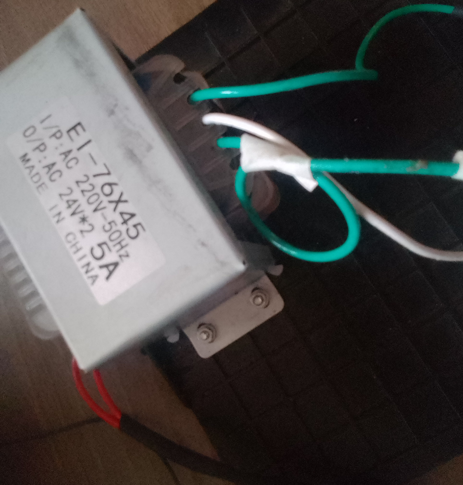
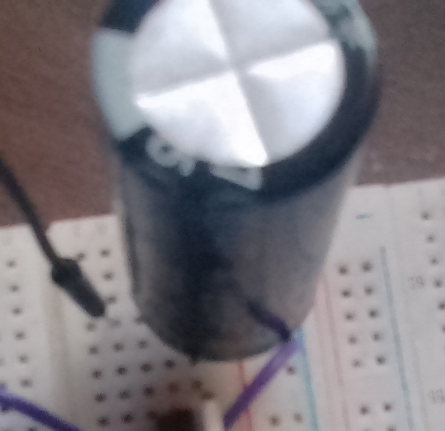
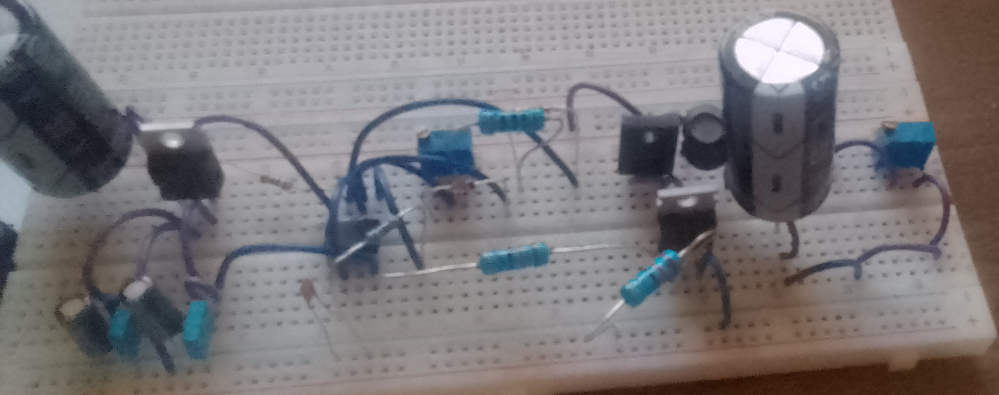

# Regulated Multi-Output DC Power Supply
## Overview
This article explains the working of a regulated multi-output DC power supply system, suitable for powering electronics projects and experiments. The design steps through stepping down AC mains using a transformer, rectifying and filtering the voltage, and regulating the output using a buck converter with a 555 timer-based controller. Several modifications are included based on specific component substitutions to improve performance and customize the output.

## **Transformer Stage**

The power supply begins with a center-tapped EI-76X45 transformer rated for 220V AC primary to 24V-0-24V AC at 5A on the secondary. Here's how it functions:

* The transformer steps down the high 220V AC mains voltage to a safer low-voltage AC.
* The center tap (0V) acts as a common ground reference.
* The two 24V AC ends produce bipolar AC outputs, allowing for efficient full-wave rectification.
* The transformer can supply up to 5A, which makes it suitable for moderate to high power applications.

## **Rectification Stage**
After the transformer, the AC voltage is rectified using four HER307 diodes in a bridge configuration.

* HER307 are high-efficiency, fast-recovery diodes rated for 1000V and 3A, ideal for rectifying at high currents with minimal losses.
* The bridge rectifier converts the 24V-0-24V AC into a pulsating DC voltage across the load.

* The theoretical peak voltage after rectification is:

𝑉
𝑝
𝑒
𝑎
𝑘
=
24
𝑉
×
2
≈
33.9
𝑉
V 
peak
​
 =24V× 
2
​
 ≈33.9V
* Subtracting diode drops (~1.4V total for two conducting diodes), the effective DC is around 32.5V.
* At 5A transformer rating, this stage can comfortably deliver up to 5A DC current assuming sufficient filtering and heat dissipation.

## **Filtering Stage**

To smooth out the ripples in the pulsating DC from the rectifier, a 4700µF / 50V electrolytic capacitor is used:

* This capacitor charges up to the peak of the rectified waveform and discharges slowly, maintaining a more steady DC voltage between peaks.
* The large capacitance allows for effective smoothing, reducing ripple voltage to 400–600 mV.
* The capacitor must be rated above the DC voltage (in this case, 50V) to handle the 32V-34V peaks safely.

## **Regulation Stage (Buck Converter)**

A custom buck converter regulates the filtered DC to a lower, stable output voltage. The regulation is done in two parts:

#### **Linear Regulator Stage (LM7812)**
A LM7812 linear voltage regulator drops the 33V DC down to 12V, which is used to power the 555 timer.

* Input and output capacitors: I replaced the standard 0.33µF and 0.1µF with 1µF 50V capacitors, which works well for added stability and transient suppression.

### **PWM Buck Converter**
The switching regulation is implemented using the following components:

* 555 Timer IC (configured as an astable multivibrator) generates a square wave PWM signal.

##### Resistors around the 555:

* 1KΩ for faster charging.
* 222 (2.2nF) ceramic capacitor adjusts frequency.
* 47KΩ resistor determines the duty cycle with the 555.
* 1N4148 diodes steer charge/discharge paths in the timing network.

* IRF540N MOSFET switches the power in response to the PWM signal.
* MBRF20100CT is a Schottky rectifier with low forward voltage drop, efficient for high-speed switching.
* 47µH inductor stores energy and smooths the switching waveform.
* Output capacitor: 4700µF / 50V (replacing 220µF) provides low ripple at the output.
* 50K potentiometer acts as an adjustable load resistor or voltage divider for output tuning.It also serve as a bleeding resistor, which slowly discharges the output capacitor when power is removed to avoid residual voltage.

## Summary
This regulated power supply project takes high-voltage 220V AC and efficiently converts it into a stable, ripple-minimized low-voltage DC output, suitable for sensitive electronics. The stages involved are:

* Transformer stage: Steps down 220V AC to dual 24V AC.
* Rectification stage: Converts AC to pulsating DC using HER307 diodes.
* Filtering stage: 4700µF capacitor smooths out ripples.
* Regulation stage:

      * LM7812 regulates a clean 12V for the 555 timer.
      * 555-based PWM buck converter regulates and steps down DC voltage via IRF540N and MBRF20100CT.

With the ability to adjust output voltage and support relatively high currents, this supply is robust and versatile for bench use or permanent projects.