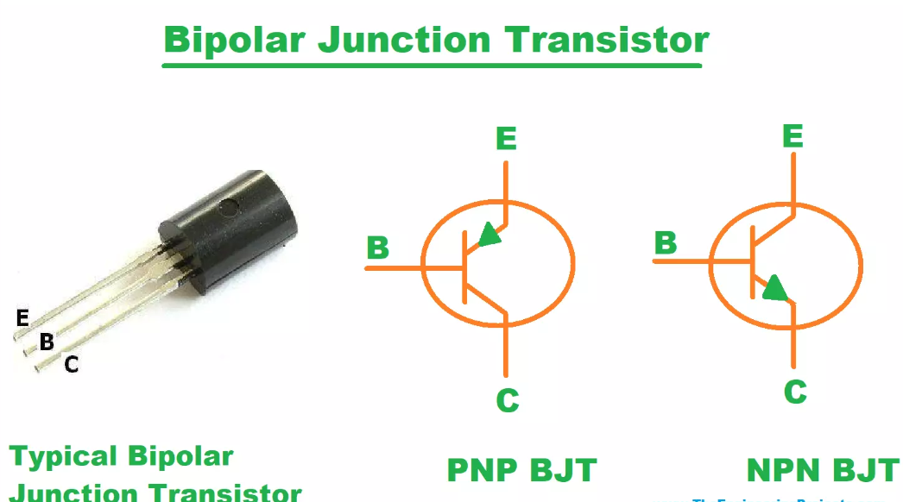

# Understanding Switching States with Transistors

Transistors are among the most fundamental components in modern electronics, serving as the building blocks of logic gates, amplifiers, and power control systems. One of their most vital applications is switching—the ability to toggle between conducting and non-conducting states. This principle underpins everything from digital computing to power electronics.
The focus on this article is placed on understanding the behavior of bipolar junction transistors (BJTs) in switching applications. It will serve as a comprehensive guide to those concepts, aimed at both beginners and intermediate learners seeking a thorough understanding.

## Table of Contents
1. Introduction to Switching with Transistors

2. The BJT as a Switch

3. Understanding the Three Regions of Operation

4. Example: Switching a Load 

5. Saturation and Cutoff 

6. Importance of Base Resistors and Calculations

7. Practical Switching Circuits 

8. Common Issues and Debugging Tips

9. Applications in Real-World Circuits

10. Conclusion

## 1. Introduction to Switching with Transistors
Transistors are three-terminal semiconductor devices that can amplify or switch electrical signals. When used as switches, transistors function by transitioning between two primary states:

* ON state (Saturation): Allows current to flow freely.

* OFF state (Cutoff): Prevents current flow.

This digital behavior—either fully on or fully off—mimics binary logic and is crucial in building digital circuits, motor controllers, and power electronics.

## 2. The BJT as a Switch
A Bipolar Junction Transistor (BJT) comes in two types:

* NPN
* PNP

In switching applications, NPN transistors are more commonly used due to their grounding configuration and ease of driving with positive logic levels.

The terminals of a BJT are:

* Base (B)
* Collector (C)
* Emitter (E)
  

**How It Works:**

When a small current flows into the base of an NPN transistor, it allows a much larger current to flow from collector to emitter. The transistor behaves like a controlled switch.

## 3. Understanding the Three Regions of Operation
A BJT operates in three distinct regions:

| **Region**   | **Base-Emitter (VBE)** | **Collector-Emitter (VCE)** | **Description**         |
|--------------|-----------------------------------|----------------------------------------|--------------------------|
| Cutoff       | VBE < 0.7V             | No collector current                   | OFF (Open switch)        |
| Active       | VBE ≈ 0.7V             | VCE > VBE        | Amplification mode       |
| Saturation   | VBE ≈ 0.7V             | VCE ≈ 0.2V                  | ON (Closed switch)       |

Only cutoff and saturation are relevant for switching.

## 4. Example: Switching a Load 
A practical example: using a BJT to turn on an LED.

**Circuit Setup:**

* NPN transistor (e.g., 2N2222 or BC547)
* LED + current-limiting resistor at the collector
* 5V supply
* 10kΩ resistor at the base
  
## Circuirt diagram

.png>)

**Operation:**

* No base current: Transistor is OFF → LED is OFF.
* Base driven HIGH: Base-emitter junction forward-biased → Transistor ON → LED lights up.

This simple demonstration illustrates that the BJT acts like a gate controlled by the base current. Once sufficient base current flows (typically ≥ IC/hFE), the transistor enters saturation, allowing current through the load.

### 5. Saturation and Cutoff

Here we will dive deeper into saturation and cutoff:

**Cutoff State:**

* VBE < 0.7V
* No base current → No collector current
* Transistor behaves like an open switch

**Saturation State:**
* VBE ≈ 0.7V (base forward-biased)
* Collector-emitter voltage drops to ~0.2V
* Transistor behaves like a closed switch
* The transistor is fully "on," allowing maximum collector current

To ensure saturation, we emphasize overdriving the base (adding more base current than strictly required by IC/hFE). This guarantees the switch is firmly ON, even with variations in hFE.

## 6. Importance of Base Resistors and Calculations
A base resistor is critical for protecting the transistor and controlling switching.

**Why Use a Base Resistor?**

* Limits current into the base
* Prevents damage to the transistor
* helps achieve saturation

**Calculation Example:**

Suppose:

VCC = 5V

Load requires IC = 100 mA

hFE (gain) = 100

***We want:***

IB ≈ IC / hFE = 1 mA
(To ensure saturation, use 2x–5x this value: say 5 mA)

Base resistor:

Vin = 5V

VBE = 0.7V

RB = (Vin - VBE) / IB
= (5 - 0.7) / 5mA = 860Ω → use standard 820Ω or 1kΩ

## 7. Practical Switching Circuits 
More complex switching applications:

* Driving relays
* Controlling motors
* Using flyback diodes

**Key Topics:**
1. Inductive Loads:
When switching inductive loads (like motors and relays), a sudden turn-off causes voltage spikes (back EMF). This can destroy the transistor.

2. Flyback Diode:
A diode (e.g., 1N4007) placed across the load (reverse-biased during normal operation) safely discharges this energy.

*Example:*

A motor is connected to the collector.

The flyback diode is placed across the motor.

The transistor switches the motor ON/OFF based on base drive.

## 8. Common Issues and Debugging Tips
**Transistor Not Turning On:**

* Insufficient base current
* Incorrect pinout
* Open base connection

**Transistor Always ON:**

* Base permanently biased
* Saturation mode not exited

**Load Not Responding:**

* Load current too high for transistor
* Check VCE drop—may not be fully saturated

We emphasizes careful measurement of VBE and VCE during testing.

## 9. Applications in Real-World Circuits
Transistor switching appears everywhere:

a). Microcontroller outputs controlling LEDs, buzzers

b). MOSFET drivers using BJTs for gate control

c). Relay control circuits

d). PWM motor drivers

e). Power sequencing and logic level interfacing

BJTs are especially useful for low-side switching, where the load connects to VCC and the transistor connects to ground.

## 10. Conclusion
Switching states with transistors is a cornerstone of electronics, forming the basis of digital logic, control systems, and power regulation. 

By understanding cutoff, saturation, proper base resistor calculations, and safe switching practices (e.g., flyback diodes), one can design robust circuits with confidence. Whether you’re switching an LED or a high-powered motor, the same fundamental principles apply.

**Tip:** Always simulate your circuit (e.g., in NI Multisim or LTSpice) before prototyping to visualize switching behavior and avoid costly errors.

## Additional Resources:
1. [LTSpice Simulation Tutorials (Analog Devices)](https://www.analog.com/en/design-center/design-tools-and-calculators/ltspice-simulator.html)

2. [BC547 Datasheet (ON Semiconductor)](https://www.onsemi.com/pdf/datasheet/bc547-d.pdf)

3. [Andre’s Course Q&A Section on Udemy](https://www.udemy.com/course/learn-electronics-from-scratch/learn/lecture/21959294#questions)

Let this be your stepping stone into more advanced topics like MOSFET switching, logic-level interfacing, and pulse-width modulation (PWM).