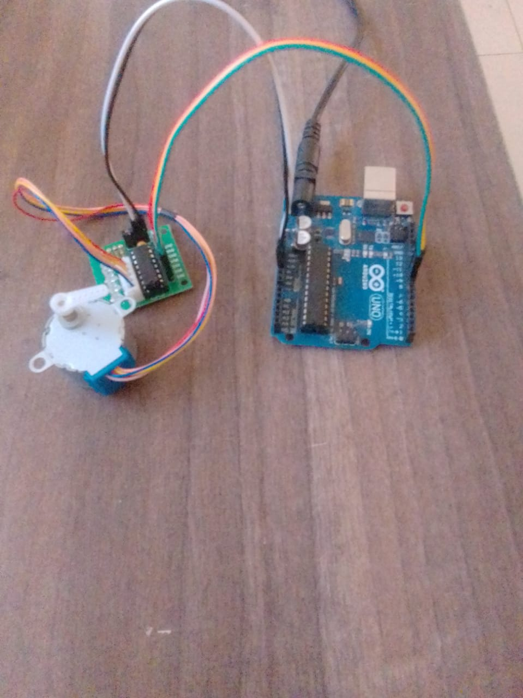
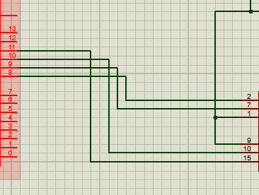
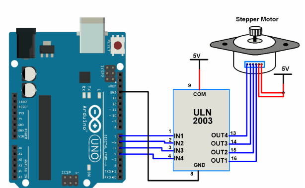

# Proteus Simulation: Arduino Stepper Control

## Why Proteus
- An easy to use interface with real-time microcontroller simulation.
- Supports  both analog and dialog components as it enable firmware testing on microcontrollers (Arduino or PIC)

## Installation of proteus
Step 1: Download Proteus zip. file
- Visit the official website (Labcenter Electronics)
- Click on Download.
- Choose the free proteus Demonstration Version or the Paid version if have License.

Step 2: Installing 
- Open the downloaded setup file (.exe).
- Follow the installation instructions:
    - Click Next.
    - Accept the license agreement.
    - Choose the installation directory.
    - Select components to install (Proteus, libraries, etc.).
    - Click Install.

Step 3:  Activate Proteus 
- Licensed version, enter your activation key during installation.
- Trial/demo, you can skip this step.

Step 4: Run Proteus
- Once installed, launch Proteus version  from the Start Menu.

Step 5: Install Additional Libraries (Optional)
- To use extra microcontrollers (e.g., Arduino) download the  additional library (Arduino library) and copy it into proteus folder location:

**Example**
 ## Friendly Guide on How to Add Arduino Library to Proteus:
Step 1: Download the Arduino Library for Proteus

- Download the Arduino Proteus Library from a trusted source. You can search for "Arduino Proteus Library zip" online.
- The file will usually be in a .zip format. Extract it to get the .IDX, .LIB, and .HEX files.
 
Step 2: Copy Library Files to Proteus
- Navigate to your Proteus installation folder .
- Copy the .LIB and .IDX files into the LIBRARY folder.
 
Step 3: Load the Arduino HEX File (For Simulation)
- Open your proteus software and create a new project.
- Click on the "P" (Pick Devices) button.
- Search for "Arduino" in the search bar.
- Select the desired Arduino board (e.g., Arduino Uno, Mega, Nano) and place it on the schematic.
- Double-click the Arduino component and locate the "Program File" section.
- Click on the folder icon and browse to your Arduino HEX file.
- The HEX file is generated from the Arduino IDE after compiling a sketch.
- You can find it in the Arduino build directory.

Step 4: Test the Library
- Connect components (LEDs, sensors, etc.).Click and hold as you drag your cursor to connect the terminals.
- Run the simulation to verify functionality.

## Troubleshooting
- If you face issues, run the setup as Administrator.

## Project Requirements. 
- In this Arduino Stepper Control Project, requuirements are categorized into:
  
1.**Hardware** 
 a) Microcontroller --> Arduino Uno (fits according to Io pins requirements and stepper motor).
 b) Stepper motor -->Bipolar [4leaded]
 c) Motor driver
 c)L293D motor driver
 d) Power supply --> 5V for stepper motor
                 --> 5-24V for L293D driver

2.**Software**
a) Arduino IDE
- Download from Arduino Official Website.
b) Required Libraries
- Stepper.h (For basic stepper control)
- AccelStepper.h (For advanced motion control like acceleration and deceleration)
- Install via Arduino Library Manager (Sketch → Include Library → Manage Libraries).


        c) Arduino Code:
- Write the code to match the project needs [speed, direction and step precision]

```cpp
#include <Stepper.h>

#define STEPS 2048 // Steps per revolution for 28BYJ-48 motor

Stepper stepper(STEPS, 8, 10, 9, 11); // Define stepper motor control pins

void setup() {
    stepper.setSpeed(10); // Set speed in RPM
    Serial.begin(9600);
}

void loop() {
    Serial.println("Rotating Forward");
    stepper.step(STEPS); // Rotate one full revolution forward
    delay(1000);
    
    Serial.println("Rotating Backward");
    stepper.step(-STEPS); // Rotate one full revolution backward
    delay(1000);
}
```


## What's missing? 
 - LN2003 driver component is missing .
 - choose another component to serve the same purpose i.e; L293D.
 - You can also design your circuit of ULN2003 driver on proteus software.

## Adding components to proteus project
- After creating a new project on proteus software, a blank root sheet opens.
- 
- Click on the "P" (Pick Devices) button
- On search bar choose the desired component the click "OK".
  
## Wiring Components  
- Take the cursor and click on one terminal then drag and click on the other terminal to complete the circuit.
 
 
 
## Uploading sketch binary to simulation

**Configurations**
 a) Increasing Clock speed;- (from 16MHz to 20MHz)
 - Delay functions may behave incorrectly since they are based on ("16MHz default timing").
 - PWM frequencies and timing dependent functions will speed causing misbehaviour.

 b)Reducing Clock speed;- (frrom 16MHz to 8MHz)
 - Arduino executes instructions slowing .
 - Timing- based functions will take long
 - PWM signal controlled motor driver might slug.

**General impact on the circuit**
  - Motor speed is affected since PWM signals are involved.
 
 **EEPROM**   
- EEPROM- used for storing non- volatile data that persists even after a power cycle.

 **Configurations**
 - Since the program [above] reads motor speed and direction then modified, motor behaviour will change after reset.
 - 
**serial monitoring**
a). Change in Clock Speed
- The serial baud rate calculation depends on the clock frequency.
- If changes are applied serial baud rate will  eventually change.
- 
  **Possible Impacts**
* Communication with external devices (like another microcontroller or PC) may fail due to baud rate mismatch.

b).  EEPROM Changes 
- If the program reads baud rate settings from EEPROM, changing EEPROM values could modify the serial communication speed.
 
## Issue Resolution
- Ensure Clock Speed Matches the Expected Baud Rate
- Manually Set Baud Rate in Serial Monitor (if using Arduino IDE)
- Add Fallback Baud Rate in Code to Prevent EEPROM Corruption Issues

## Conclusion
- By tweaking these values, we can control the motor’s speed, direction, and step precision to match our project’s needs.
- In reference to clock speed and EEPROM, change in values has a significant impact on the circuit.
  
### Resources 

1. Proteus Installation:https://www.labcenter.com 

 **TODO**

- If a component is not available on proteus library you should :
 1. Manually add the missing component's library on proteus
 - Example;
  
 If L293D is not available in the default library, follow these steps:

            a). Download the L293D Library for Proteus

            - Search online for "L293D Proteus Library Download" and find a trusted source.
            - Download the .IDX and .LIB files.
             
            b). Install the Library
            - Move the downloaded .LIB and .IDX files to the Proteus Library Folder, typically found at:
                 (C:\Program Files (x86)\Labcenter Electronics\Proteus 8 Professional\LIBRARY)

            c). Restart Proteus
            - Close and reopen Proteus to load the new components.

            d).Search Again
             - Check if the component is now available in the proteus library.