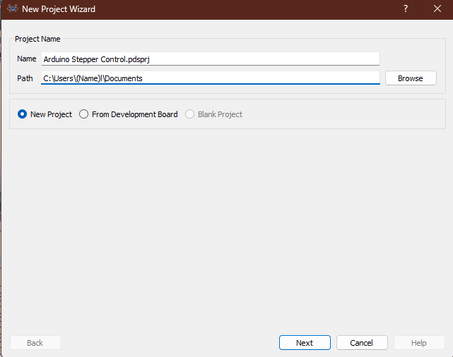

# Proteus Circuit Simulations

## Why Proteus

- Proteus is a design suite with a couple of powerful features set to enable the rapid design, test and layout of PCBs for both educational and professional needs.
- Supports both analog and digital components. This enables firmware testing on microcontrollers such as Arduino,PICs, and more.

## Installation of proteus

Step 1: Download Proteus
- Visit the official website [(Labcenter Electronics)](https://www.labcenter.com/)
- Proteus Design Suite has the following components
  - Proteus PCB design - provides schematic capture and PCB layout.
  - Proteus Circuit Simulation - Incorporates SPICE simulation and fast microcontroller simulation. With it you can simulate your electronic circuit before prototyping.
  - Proteus IoT Builder - Has a visual designer and Proteus VSM for Arduino and Pi products
- Click on either of the three options and select either a free trial or the paid license version dependending on your needs.

Step 2: Installing 
- Open the downloaded setup file (.exe).
- Follow the installation instructions:
    - Click Next.
    - Accept the license agreement.
    - Choose the installation directory.
    - Select components to install (Proteus, libraries, etc.).
    - Click Install.

Step 3:  Activate Proteus
- Licensed version, enter your activation key during installation.
- Trial/demo, you can skip this step.

Step 4: Run Proteus
- Once installed, launch your Proteus version  from the Start Menu.
  
Step 5: Install Additional Libraries(Optional)
- To use extra microcontrollers(e.g.,Arduino) download the additional library(Arduino Library) and copy it into proteus folder location:
  
## Additional components

For instance, the official proteus installation lib do not have Arduino components. Let me guide through the installation of the Arduino Library. 

Step 1: Download the Arduino Library for Proteus

- Download the Arduino Proteus Library from a trusted source. You can search for "Arduino Proteus Library zip" online.
- The file will usually be in a .zip format. Extract it to get the .IDX, .LIB, and .HEX files.
 
Step 2: Copy Library Files to Proteus
- Navigate to your Proteus installation folder .
- Copy the .LIB and .IDX files into the LIBRARY folder.
 
Step 3: Load the Arduino HEX File (For Simulation)
- Open your proteus software and create a new project.
- Click on the "P" (Pick Devices) button.
- Search for "Arduino" in the search bar.
- Select the desired Arduino board (e.g., Arduino Uno, Mega, Nano) and place it on the schematic.
- Double-click the Arduino component and locate the "Program File" section.
- Click on the folder icon and browse to your Arduino HEX file.
- The HEX file is generated from the Arduino IDE after compiling a sketch.
- You can find it in the Arduino build directory.

Step 4: Test the Library
- Connect components (LEDs, sensors, etc.).Click and hold as you drag your cursor to connect the terminals.
- Run the simulation to verify functionality.

## Key Features of Proteus 

1. Schematic Capture (Circuit Design)
- You can draw circuit diagrams using different electronic components like resistors, capacitors, transistors, and microcontrollers.
- It works like a virtual breadboard where you connect components to see how they interact.

2. Simulation (Testing Your Circuit)
- Once you design your circuit, you can simulate it to check if it works correctly.
- For example, if you create an LED blinking circuit, you can see the LED turning on and off on your computer screen.

3. PCB Design (Printed Circuit Board Layout)
- If you want to make a real electronic circuit, you can convert your schematic into a PCB layout.
- You arrange components on a board and create connections (called "traces") just like a real circuit board.

4. Microcontroller Simulation
- You can write and test code for microcontrollers like Arduino, PIC, and AVR inside Proteus.
- This means you can run a virtual program to see how a microcontroller will behave before actually uploading it to real hardware.


## Troubleshooting
- If you face issues, run the setup as Administrator.
  
 ## Writing Firmware Using Proteus 
 - Running a firmware based-project using proteus requires a different approach.
  
  **Example**
  ### Firmware project:
  ### LED Project(blinking LED)
- Create a new project ,name the project on "project wizard menu".
- Selected a suitable compiler from "Development board"
- 
- click "finish" .
- On the root sheet you already have ATMEGA328P chip,select other components by clicking pick device button[P].
  ### Components Needed
  - Button
  - LED-yellow
  - Resistor -470ohm's (change resistance value by right clicking on the component then select "edit properties").

  ### Project PCB Design 
  - 
  
  ### Project Source Code:
- On the left upper corner of the root sheet there are both "Schematic capture" and "source code" button.
- After you are done with the schematic, clicking on the "source code" button.
- Write your code here.
  
  **Code**
```cpp
void setup() {
  // initialize digital pin LED_BUILTIN as an output.
  pinMode(LED_BUILTIN, OUTPUT);
}

// the loop function runs over and over again forever
void loop() {
  digitalWrite(LED_BUILTIN, HIGH);  // turn the LED on (HIGH is the voltage level)
  delay(1000);                      // wait for a second
  digitalWrite(LED_BUILTIN, LOW);   // turn the LED off by making the voltage LOW
  delay(1000);                      // wait for a second
}
``` 
- Finish writing the code then click on the "Build" button on the upper left corner of the screen.Under "Build" button click "Build Project" to upload your code to the controller.
- Click the pause button on the bottom left corner of your  screen to run the setup.
 
 - 
   ### Troubleshooting 
   - If  faced with changelle uploading yourcode, trace the issue using the terminal below the code.
   - Run the setup as administrator(optional).
  
## New project (Arduino Stepper Control)
 
- After the launch, click "New Project" on proteus start menu.
- Give a Name to your project on the menu that pops up;
- 
- Click "Next" button then choose whether or not to create a schematic.
- if chose "DO not create a schematic" then keep clicking "Next" button till a blank root sheet opens up where you choose your components.
- If chose "Create a schematic ...", you are to select one design template or go with the "Default" (In accordance to project requirements.)
  
Step 5: Install Additional Libraries(Optional)
- To use extra microcontrollers(e.g.,Arduino) download the additional library(Arduino Library) and copy it into proteus folder location:
## Project Requirements. 
- In this Arduino Stepper Control Project, requuirements are categorized into:
  
1.**Hardware**

 a) Microcontroller --> Arduino Uno (fits according to Io pins requirements and stepper motor).
 b) Stepper motor -->Bipolar [4leaded].

 c)L293D motor driver.

 d) Power supply --> 5V for stepper motor.

              --> 5-24V for L293D driver

2.**Software**

a) Arduino IDE
- Download from Arduino Official Website.
  
b) Required Libraries
- Stepper.h (For basic stepper control)
- AccelStepper.h (For advanced motion control like acceleration and deceleration)
- Install via Arduino Library Manager (Sketch → Include Library → Manage Libraries).


c) Arduino Code:
- Write the code to match the project needs [speed, direction and step precision]


```cpp
#include <Stepper.h>

#define STEPS 2048 // Steps per revolution for 28BYJ-48 motor

Stepper stepper(STEPS, 8, 10, 9, 11); // Define stepper motor control pins

void setup() {
    stepper.setSpeed(10); // Set speed in RPM
    Serial.begin(9600);
}

void loop() {
    Serial.println("Rotating Forward");
    stepper.step(STEPS); // Rotate one full revolution forward
    delay(1000);
    
    Serial.println("Rotating Backward");
    stepper.step(-STEPS); // Rotate one full revolution backward
    delay(1000);
}
```


## What's missing? 
 - ULN2003 driver component is missing .
 - choose another component to serve the same purpose i.e; L293D.
 - You can also design your circuit of ULN2003 driver on proteus software.

## Adding components to proteus project
- After creating a new project on proteus software, a blank root sheet opens.
- Click on the "P" (Pick Devices) button
-  
- On search bar choose the desired component then click "OK".
-   

## Wiring Components  
- Take the cursor and click on one terminal then drag and click on the other terminal to complete the circuit.
 
 

## Uploading sketch binary to simulation
- Double click on the Arduino component, "Edit Component" feature appears.
- Click on Program file to be able to choose your .hex file then click "OK" to upload to your arduino component.

**Configurations and impacts**
- On the "Edit Component" feature locate [clock frequency and initial contents of data EEPROM] to be able make adjustments.
  
 a) Increasing Clock speed;- (from 16MHz to 20MHz)
 - Delay functions may behave incorrectly since they are based on ("16MHz default timing").
 - PWM frequencies and timing dependent functions will speed causing misbehaviour.

 b)Reducing Clock speed;- (frrom 16MHz to 8MHz)
 - Arduino executes instructions slowing .
 - Timing- based functions will take long
 - PWM signal controlled motor driver might slug.

**General impact on the circuit**
  - Motor speed is affected since PWM signals are involved.
 
 **EEPROM**   
- EEPROM- used for storing non- volatile data that persists even after a power cycle.

 **Configurations and impacts**
 - Since the program [above] reads motor speed and direction then modified, motor behaviour will change after reset.
 - 
**serial monitoring**
a). Change in Clock Speed
- The serial baud rate calculation depends on the clock frequency.
- If changes are applied serial baud rate will  eventually change.
- 
  **Possible Impacts**
* Communication with external devices (like another microcontroller or PC) may fail due to baud rate mismatch.

b).  EEPROM Changes 
- If the program reads baud rate settings from EEPROM, changing EEPROM values could modify the serial communication speed.
 
## Issue Resolution
- Ensure Clock Speed Matches the Expected Baud Rate
- Manually Set Baud Rate in Serial Monitor (if using Arduino IDE)
- Add Fallback Baud Rate in Code to Prevent EEPROM Corruption Issues

## Conclusion
- By tweaking these values, we can control the motor’s speed, direction, and step precision to match our project’s needs.
- In reference to clock speed and EEPROM, change in values has a significant impact on the circuit.
  
### Resources 

1. Proteus Installation: https://www.labcenter.com 
2. Downloading Arduino Library for Proteus: https://www.theengineeringprojects.com/2015/12/arduino-library-proteus-simulation.html

 **TODO**

- If a component is not available on proteus library you should :
 1. Manually add the missing component's library on proteus
 - Example;
  
 If L293D is not available in the default library, follow these steps:

            a). Download the L293D Library for Proteus

            - Search online for "L293D Proteus Library Download" and find a trusted source.
            - Download the .IDX and .LIB files.
             
            b). Install the Library
            - Move the downloaded .LIB and .IDX files to the Proteus Library Folder, typically found at:
                 (C:\Program Files (x86)\Labcenter Electronics\Proteus 8 Professional\LIBRARY)

            c). Restart Proteus
            - Close and reopen Proteus to load the new components.

            d).Search Again
             - Check if the component is now available in the proteus library.

 2. Choose a different component of same family to serve same purpose.
    (i.e, replace ULN2003 with L293D)